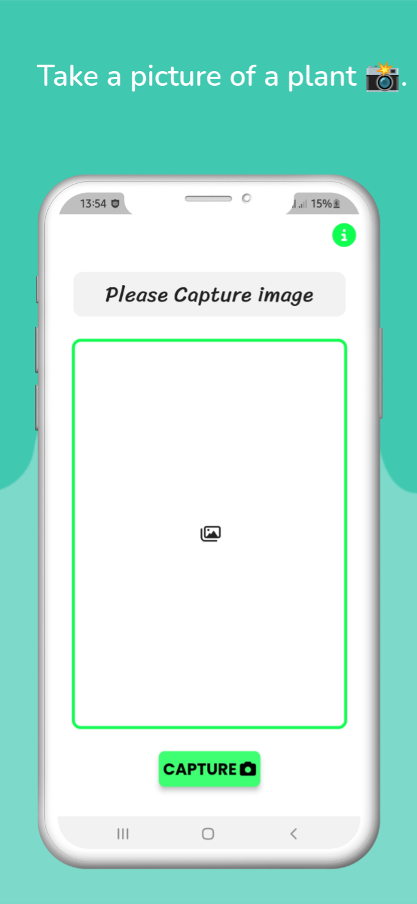
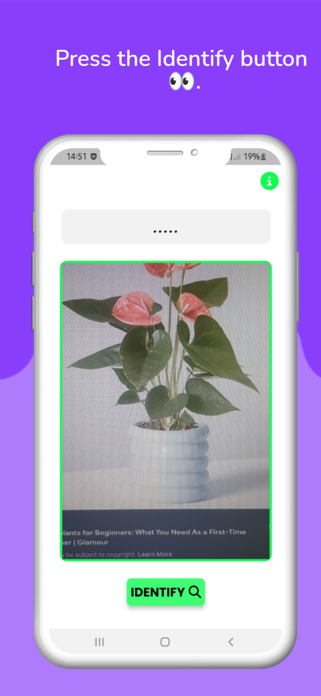
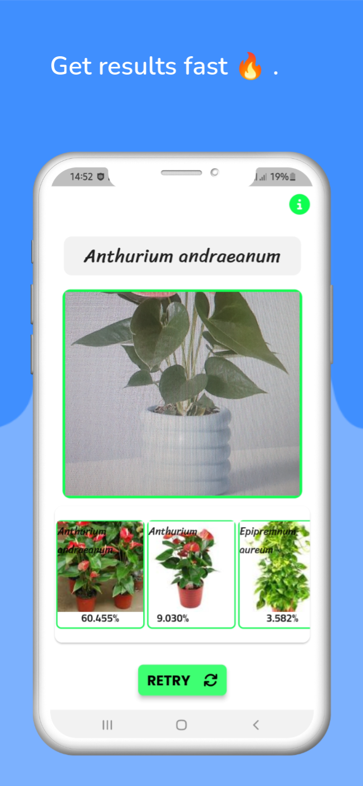

### Preview

| Screenshot 1 | Screenshot 2 | Screenshot 3 |
| :-------------------------------------: | :-------------------------------------: |  :--------------------------------------: |
|  |  |  |

---

  

  

  

 

 

**[PROJECT PHILOSOPHY](https://github.com/babe-saleh-mahfoud/Nebat#-project-philosophy) •
[WIKI](https://github.com/babe-saleh-mahfoud/Nebat#-wiki) •
[TECH STACK](https://github.com/babe-saleh-mahfoud/Nebat#-tech-stack) •
[CONTRIBUTING](https://github.com/babe-saleh-mahfoud/Nebat#%EF%B8%8F-contributing) •
[SPREAD THE WORD](https://github.com/babe-saleh-mahfoud/Nebat#-spread-the-word) •
[LICENSE](https://github.com/babe-saleh-mahfoud/Nebat#%EF%B8%8F-license)**

 

# 🧐 Project philosophy

I wanted to create a very elegant and fast plant recognition app.

# 👨‍💻 Tech stack

Here's a brief high-level overview of the tech stack the Nebat app uses:

- This project uses the [Flutter app development framework](https://flutter.dev/).

- I used [Plant.id](https://plant.id)'s API.

# ✍️ Contributing

Interested in contributing to Nebat project? Thanks so much for your interest! We are always looking for improvements to the project and contributions from open-source developers are greatly appreciated.

If you have a contribution in mind, Feel free to open an issue and then submit your PR, and i will check it out in the nearest time possible.

# 🌟 Spread the word!

If you want to say thank you and/or support active development of Nebat:

- Add a GitHub Star to the project!
- Tag [@babe saleh mahfoud](https://www.linkedin.com/in/babe-saleh-mahfoud-519b52200/) and/or `#Nebat`

Thanks so much for your interest in growing the reach of Nebat!

# ⚠️ License

Nebat is free and open-source software licensed under the GNU General Public License v3.0. All the codebase is written by [Babe Saleh Mahfoud](https://github.com/babe-saleh-mahfoud) and distributed under Creative Commons license (CC BY-SA 4.0 International).

The above Illustration is attributed to [freepik.com](https://www.freepik.com/)
 

---
